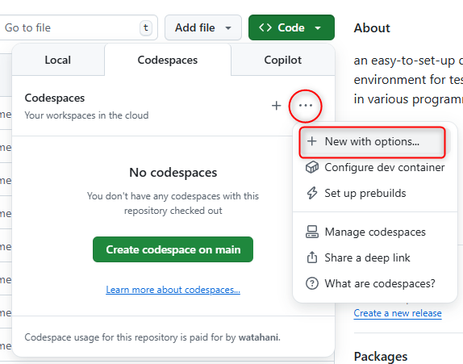
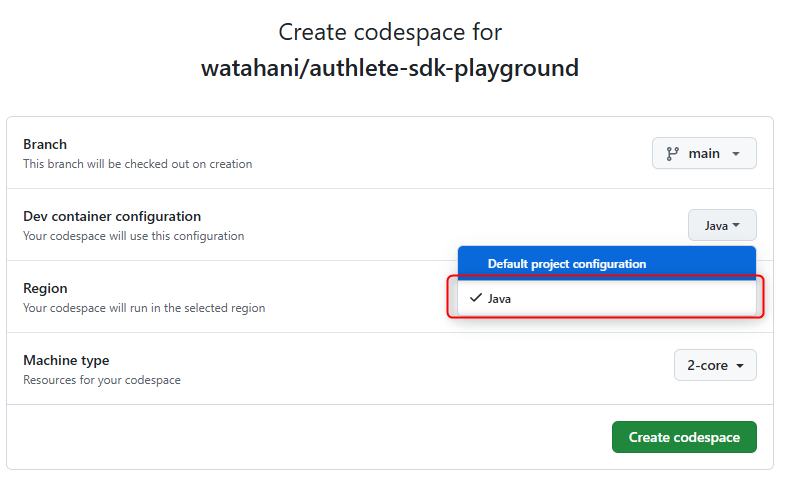

# Authlete SDK Playground

このプロジェクトは、様々なプログラミング言語で Authlete SDK をテストするための簡単にセットアップできる開発環境を提供します。各言語のフォルダには簡単なコンソールアプリケーションが含まれており、それぞれに対応するdevcontainer設定が`.devcontainer/{lang}`ディレクトリに配置されています。
Visual Studio CodeのDev Containers または GitHub Codespaces を使用することで、最小限のセットアップで完全に構成された開発環境を起動できます。

## サポートされている言語

現在、以下の言語が実装されています：

- ✅ Java
- 🚧 C#（近日公開）
- ✅ Go
- 🚧 JavaScript（近日公開）
- 🚧 Python（近日公開）
- 🚧 Ruby（近日公開）
- 🚧 TypeScript（近日公開）

## 前提条件

- [Visual Studio Code](https://code.visualstudio.com/)
- [Dev Containers拡張機能](https://marketplace.visualstudio.com/items?itemName=ms-vscode-remote.remote-containers)
- [Docker](https://www.docker.com/products/docker-desktop/)

または：

- GitHubアカウント（GitHub Codespacesを使用する場合）

## 始め方

### Visual Studio Code Dev Containersを使用する

1. このリポジトリをクローンします：
   ```bash
   git clone https://github.com/your-organization/authlete-sdk-executor.git
   cd authlete-sdk-executor
   ```

2. Authlete認証情報を設定します：
   - `.env.dev`を`.env`にコピーします（存在しない場合）
   - `.env`を編集してAuthlete認証情報を追加します：
     ```
     AUTHLETE_BASE_URL=https://api.authlete.com
     AUTHLETE_SERVICE_APIKEY=your-api-key
     AUTHLETE_SERVICE_APISECRET=your-api-secret
     ```

     v3 の場合

     ```
     AUTHLETE_BASE_URL=https://us.authlete.com
     AUTHLETE_SERVICE_APIKEY=your-api-key
     AUTHLETE_SERVICE_ACCESSTOKEN=your-api-token
     AUTHLETE_API_VERSION=3
     ```


3. プロジェクトをVisual Studio Codeで開きます：
   ```bash
   code .
   ```

4. 作業する言語を選択します（例：Java）：
   - コマンドパレットを開きます（F1またはCtrl+Shift+P）
   - 「Dev Containers: Reopen in Container」を選択します
   - 特定の言語コンテナを選択します（例：「Java」）

5. コンテナがビルドされ起動し、選択した言語用に構成された環境が提供されます。

6. 各言語のエントリポイント (例 src/main/java/com/authlete/sdklab/App.java) のファイルを開き、F5 キーで実行します。

### GitHub Codespacesを使用する

1. `Use this template` > `Create new repository` をクリックしてテンプレートリポジトリをコピーします

2. Authlete 認証情報をコピーしたリポジトリの GitHub Codespaces シークレットとして設定します：
   - リポジトリの設定に移動します
   - 「Secrets > Codespaces」に移動します
   - 以下のシークレットを追加します：
     ```
     AUTHLETE_BASE_URL=https://api.authlete.com
     AUTHLETE_SERVICE_APIKEY=your-api-key
     AUTHLETE_SERVICE_APISECRET=your-api-secret
     ```

     v3 の場合

     ```
     AUTHLETE_BASE_URL=https://us.authlete.com
     AUTHLETE_SERVICE_APIKEY=your-api-key
     AUTHLETE_SERVICE_ACCESSTOKEN=your-api-token
     AUTHLETE_API_VERSION=3
     ```
3. 「Code」ボタンをクリックし、「Codespaces」を選択します。
4. New with options を選択します。



5. Dev container configuration から好きな言語を選択し、Codespace を作成します。



6. 環境変数が適切に構成された状態でCodespaceが起動します。

## サンプルアプリケーションの実行

各言語のエントリポイント (例 src/main/java/com/authlete/sdklab/App.java) のファイルを開き、F5 キーで実行します。

## 環境変数

SDKでは以下の環境変数が使用されます：

| 変数 | 説明 | 必須 |
|----------|-------------|----------|
| AUTHLETE_BASE_URL | Authlete APIのベースURL | はい |
| AUTHLETE_SERVICE_APIKEY | AuthleteサービスのAPIキー | はい |
| AUTHLETE_SERVICE_APISECRET | AuthleteサービスのAPIシークレット | はい (v2) |
| AUTHLETE_SERVICEOWNER_APIKEY | AuthleteサービスオーナーのAPIキー | いいえ |
| AUTHLETE_SERVICEOWNER_APISECRET | AuthleteサービスオーナーのAPIシークレット | いいえ |
| AUTHLETE_SERVICEOWNER_ACCESSTOKEN | Authleteサービスオーナーのアクセストークン | はい (v3) |
| AUTHLETE_SERVICE_ACCESSTOKEN | Authleteサービスのアクセストークン | いいえ |
| AUTHLETE_DPOP_KEY | DPoPキー | いいえ |
| AUTHLETE_CLIENT_CERTIFICATE | クライアント証明書 | いいえ |
| AUTHLETE_API_VERSION | Authlete APIバージョン | いいえ |

## 環境のカスタマイズ

各言語環境は、対応するファイルを変更することでカスタマイズできます：

- `.devcontainer/{lang}/devcontainer.json`：Dev Container設定
- `.devcontainer/{lang}/docker-compose.yml`（該当する場合）：Docker Compose設定
- `{lang}/Dockerfile`（該当する場合）：Dockerイメージ設定

## 貢献

追加の言語のサポートを追加したり、既存の実装を改善したりするための貢献を歓迎します！

## ライセンス

MIT
