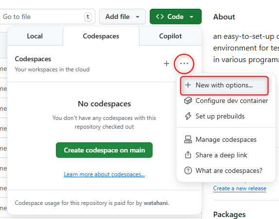
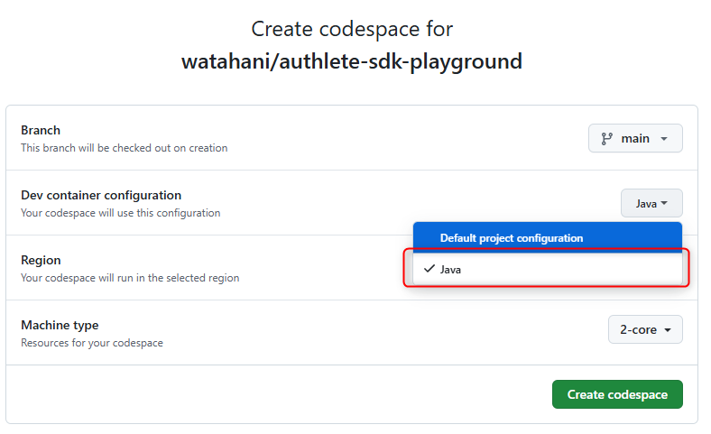

# Authlete SDK Playground

このプロジェクトは、様々なプログラミング言語で Authlete SDK をテストするための簡単にセットアップできる開発環境を提供します。各言語のフォルダには簡単なコンソールアプリケーションが含まれており、それぞれに対応するdevcontainer設定が`.devcontainer/{lang}`ディレクトリに配置されています。
Visual Studio CodeのDev Containers または GitHub Codespaces を使用することで、最小限のセットアップで完全に構成された開発環境を起動できます。

## サポートされている言語

現在、以下の言語が実装されています：

| 言語 | ステータス | Codespaces で開く |
|------|-----------|-------------------|
| Java | ✅ | [](https://codespaces.new/watahani/authlete-sdk-playground?devcontainer_path=.devcontainer/java/devcontainer.json) |
| Java Jakarta | ✅ | [](https://codespaces.new/watahani/authlete-sdk-playground?devcontainer_path=.devcontainer/java-jakarta/devcontainer.json) |
| Java JAX-RS (レガシー) | ✅ | [](https://codespaces.new/watahani/authlete-sdk-playground?devcontainer_path=.devcontainer/java-jaxrs/devcontainer.json) |
| C# | 🚧 近日公開 | |
| Go | ✅ | [](https://codespaces.new/watahani/authlete-sdk-playground?devcontainer_path=.devcontainer/go/devcontainer.json) |
| JavaScript | 🚧 近日公開 | |
| Python | 🚧 近日公開 | |
| Ruby (v2) | ✅ | [](https://codespaces.new/watahani/authlete-sdk-playground?devcontainer_path=.devcontainer/ruby-v2/devcontainer.json) |
| Ruby (v3) | ✅ | [](https://codespaces.new/watahani/authlete-sdk-playground?devcontainer_path=.devcontainer/ruby/devcontainer.json) |
| TypeScript | ✅ | [](https://codespaces.new/watahani/authlete-sdk-playground?devcontainer_path=.devcontainer/typescript/devcontainer.json) |
| PHP | ✅ | [](https://codespaces.new/watahani/authlete-sdk-playground?devcontainer_path=.devcontainer/php/devcontainer.json) |

## 前提条件

- [Visual Studio Code](https://code.visualstudio.com/)
- [Dev Containers拡張機能](https://marketplace.visualstudio.com/items?itemName=ms-vscode-remote.remote-containers)
- [Docker](https://www.docker.com/products/docker-desktop/)

または：

- GitHubアカウント（GitHub Codespacesを使用する場合）

## 始め方

### Visual Studio Code Dev Containersを使用する

1. このリポジトリをクローンします：
   ```bash
   git clone https://github.com/watahani/authlete-sdk-playground.git
   cd authlete-sdk-playground
   ```

2. Authlete認証情報を設定します：
   - `.env.local.example` を `.env.local` にコピーします（ローカルで Dev Container を動かす場合に必須。Codespaces ではファイルが無い場合に自動生成されます）。
   - リポジトリ直下の `.env.local` を編集し、認証情報を設定します：
     ```
     AUTHLETE_BASE_URL=https://api.authlete.com
     AUTHLETE_SERVICE_APIKEY=your-api-key
     AUTHLETE_SERVICE_APISECRET=your-api-secret
     ```

     v3 の場合：

     ```
     AUTHLETE_BASE_URL=https://us.authlete.com
     AUTHLETE_SERVICE_APIKEY=your-api-key
     AUTHLETE_SERVICE_ACCESSTOKEN=your-api-token
     AUTHLETE_API_VERSION=3
     ```


3. プロジェクトをVisual Studio Codeで開きます：
   ```bash
   code .
   ```

4. 作業する言語を選択します（例：Java）：
   - コマンドパレットを開きます（F1またはCtrl+Shift+P）
   - 「Dev Containers: Reopen in Container」を選択します
   - 特定の言語コンテナを選択します（例：「Java」）

5. コンテナがビルドされ起動し、選択した言語用に構成された環境が提供されます。

6. 各言語のエントリポイント (例 src/main/java/com/authlete/sdklab/App.java) のファイルを開き、F5 キーで実行します。

### GitHub Codespacesを使用する

1. `Use this template` > `Create new repository` をクリックしてテンプレートリポジトリをコピーします

2. Authlete 認証情報をコピーしたリポジトリの GitHub Codespaces シークレットとして設定します：
   - リポジトリの設定に移動します
   - 「Secrets > Codespaces」に移動します
   - 以下のシークレットを追加します：
     ```
     AUTHLETE_BASE_URL=https://api.authlete.com
     AUTHLETE_SERVICE_APIKEY=your-api-key
     AUTHLETE_SERVICE_APISECRET=your-api-secret
     ```

     v3 の場合：

     ```
     AUTHLETE_BASE_URL=https://us.authlete.com
     AUTHLETE_SERVICE_APIKEY=your-api-key
     AUTHLETE_SERVICE_ACCESSTOKEN=your-api-token
     AUTHLETE_API_VERSION=3
     ```
3. 「Code」ボタンをクリックし、「Codespaces」を選択します。
4. New with options を選択します。



5. Dev container configuration から好きな言語を選択し、Codespace を作成します。



6. 環境変数が適切に構成された状態で Codespace が起動します。

## サンプルアプリケーションの実行

各言語のエントリポイント (例 src/main/java/com/authlete/sdklab/App.java) のファイルを開き、F5 キーで実行します。

## 環境変数

SDKでは以下の環境変数が使用されます：

| 変数 | 説明 | 必須 |
|----------|-------------|----------|
| AUTHLETE_BASE_URL | Authlete APIのベースURL | はい |
| AUTHLETE_SERVICE_APIKEY | AuthleteサービスのAPIキー | はい |
| AUTHLETE_SERVICE_APISECRET | AuthleteサービスのAPIシークレット | はい (v2) |
| AUTHLETE_SERVICEOWNER_APIKEY | AuthleteサービスオーナーのAPIキー | いいえ |
| AUTHLETE_SERVICEOWNER_APISECRET | AuthleteサービスオーナーのAPIシークレット | いいえ |
| AUTHLETE_SERVICE_ACCESSTOKEN | Authleteサービスのアクセストークン | はい (v3) |
| AUTHLETE_DPOP_KEY | DPoPキー | いいえ |
| AUTHLETE_CLIENT_CERTIFICATE | クライアント証明書 | いいえ |
| AUTHLETE_API_VERSION | Authlete APIバージョン | いいえ |

このサンプルでは、環境変数から設定を読み込む機能がある SDK については、その機能を使用しています。
その機能がない SDK の場合は、以下の環境変数を明示的に読み取ってクライアントをインスタンス化しています。

- AUTHLETE_BASE_URL
- AUTHLETE_SERVICE_APIKEY
- AUTHLETE_SERVICE_APISECRET
- AUTHLETE_SERVICE_ACCESSTOKEN
- AUTHLETE_API_VERSION

## スモークテスト

各言語のディレクトリには、実際の Authlete サーバーに対して OAuth 2.0
認可コードフローを一通り実行するスモークテストが含まれています：

1. クライアント管理 API でテスト用クライアントを作成
2. `/auth/authorization`（`response_type=code`）
3. `/auth/authorization/issue`
4. `/auth/token`（認可コードをアクセストークンに交換）
5. `/auth/introspection`（発行されたアクセストークンを検証）
6. テスト用クライアントを削除（失敗時も必ず実行）

テストはサンプルアプリケーションと同じ `AUTHLETE_*` 環境変数を参照し、
資格情報が設定されていない場合はスキップされるため、チェックアウト直後でも
失敗しません。

| 言語 | コマンド（Dev Container 内で実行） | API バージョン |
|------|-------------------------------------|----------------|
| Java / Java Jakarta / Java JAX-RS | `mvn test` | V2 と V3 |
| Go | `go test ./...` | V2 のみ |
| Ruby (v3) | `bundle exec ruby test/authorization_code_flow_test.rb` | V3 のみ |
| Ruby (v2) | `bundle exec ruby test/authorization_code_flow_test.rb` | V2 のみ |
| TypeScript | `npm test` | V3 のみ |
| PHP | `composer test` | V2 のみ |

すべてのスモークテストは、SDK が対応する API バージョンのバージョン別変数
（`AUTHLETE_V2_BASE_URL`、`AUTHLETE_V2_SERVICE_APIKEY`、
`AUTHLETE_V2_SERVICE_APISECRET`、`AUTHLETE_V3_BASE_URL`、
`AUTHLETE_V3_SERVICE_APIKEY`、`AUTHLETE_V3_SERVICE_ACCESSTOKEN`）を優先して
参照するため、1 つの `.env.local` で全言語をまとめて検証できます（Java は
1 回の実行で V2 / V3 の両方をテストします）。バージョン別変数が未設定の
場合は、API バージョンが一致するときに限り既存の `AUTHLETE_*` 変数に
フォールバックします。資格情報が無いフローはスキップされます。

注意: V3 のサービスアクセストークンには `CREATE_CLIENT` / `DELETE_CLIENT`
のアクセス権限が必要です。権限が無い場合、クライアント作成が `A457101`
で失敗します。

GitHub Actions ワークフロー `Devcontainer smoke test`
（`.github/workflows/devcontainer-smoke-test.yml`）は、言語ディレクトリに
変更がある Pull Request ごとに各言語の Dev Container（GitHub Codespaces と
同じ構成）をビルドし、コンテナ内でこれらのテストを実行します。これにより
SDK 自動更新 PR も自動的に検証されます。

## 環境のカスタマイズ

各言語環境は、対応するファイルを変更することでカスタマイズできます：

- `.devcontainer/{lang}/devcontainer.json`：Dev Container設定
- `.devcontainer/{lang}/docker-compose.yml`（該当する場合）：Docker Compose設定
- `{lang}/Dockerfile`（該当する場合）：Dockerイメージ設定

## 貢献

追加の言語のサポートを追加したり、既存の実装を改善したりするための貢献を歓迎します！
言語のサポートを追加する場合、以下の手順がおすすめです。

開発を始める際は、まず `.devcontainer/java/` 以下の内容をコピーすることをお勧めします。  
以下は、コピーしたファイル内で更新が必要なポイントです：

- `devcontainer.json`
   - `name`：使用する言語に合わせて調整してください  
   - `workspaceFolder`：使用する言語に合わせて調整してください  
   - `features`：Java 固有の拡張機能は削除し、対象言語に関連する機能を追加してください  
   - `customizations.vscode.extensions`：対象言語でデバッグするために必要な VSCode 拡張機能を指定してください  
   - `remoteUser`：使用するコンテナイメージに含まれる `non-root user` を指定してください *

- `docker-compose.yml`
   - `context`：対象言語に合わせて更新してください  
   - `build`：言語に関連する追加ツールのインストールやモジュールキャッシュが必要な場合は、適切なフォルダを `build context` に指定してください。  
   　特に必要がない場合は、`image` プロパティを使用して開発用イメージを直接指定してください。

- `{lang}/.gitignore`
   - 使用言語に適した `.gitignore` ファイルを追加してください

> ※ 一部のイメージには、ベースイメージに `ubuntu` などの非 root ユーザーが含まれている場合があります。  
> そのようなユーザーが含まれていない場合は、[Go のサンプル](go/Dockerfile) のように非 root ユーザーを追加できます。

これらの変更を加えたら、DevContainer を起動し、選択した言語でソースファイルの作成を始めてください（例：Node.js なら `npm init -y` など）。

## ライセンス

MIT
