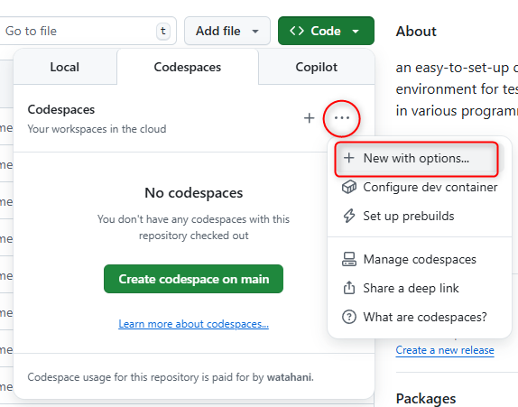
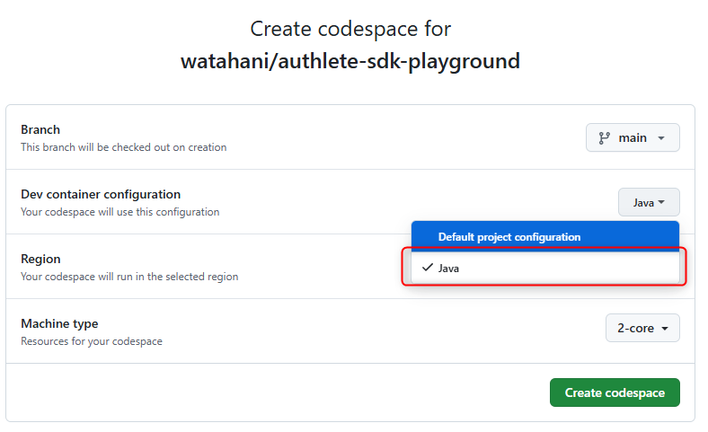

# Authlete SDK Playground

This project provides an easy-to-set-up development environment for testing the Authlete SDK in various programming languages.
Each language folder contains a simple console application, and the corresponding devcontainer configuration is located in the .devcontainer/{lang} directory.
By using Visual Studio Code Dev Containers or GitHub Codespaces, you can launch a fully configured development environment with minimal setup.

## Supported Languages

The following languages are currently implemented:

- ✅ Java  
- 🚧 C# (Coming Soon)  
- ✅ Go 
- 🚧 JavaScript (Coming Soon)  
- 🚧 Python (Coming Soon)  
- ✅ Ruby (v2)
- ✅ Ruby (v3)
- ✅ TypeScript
- ✅ PHP  

## Prerequisites

- [Visual Studio Code](https://code.visualstudio.com/)
- [Dev Containers Extension](https://marketplace.visualstudio.com/items?itemName=ms-vscode-remote.remote-containers)
- [Docker](https://www.docker.com/products/docker-desktop)

Or:

- A GitHub account (if using GitHub Codespaces)

## Getting Started

### Using Visual Studio Code Dev Containers

1. Clone this repository:
   ```bash
   git clone https://github.com/your-organization/authlete-sdk-executor.git
   cd authlete-sdk-executor
   ```

2. Set up Authlete credentials:
   - Copy `.env.local.example` to `.env.local` (required when running Dev Containers locally so Docker can load the values). In GitHub Codespaces the file is auto-created if missing, but providing `.env.local` locally avoids errors.
   - Edit `.env.local` to add your Authlete credentials:
     ```
     AUTHLETE_BASE_URL=https://api.authlete.com
     AUTHLETE_SERVICE_APIKEY=your-api-key
     AUTHLETE_SERVICE_APISECRET=your-api-secret
     ```

     For v3:

     ```
     AUTHLETE_BASE_URL=https://us.authlete.com
     AUTHLETE_SERVICE_APIKEY=your-api-key
     AUTHLETE_SERVICE_ACCESSTOKEN=your-api-token
     AUTHLETE_API_VERSION=3
     ```

3. Open the project in Visual Studio Code:
   ```bash
   code .
   ```

4. Choose the language you want to work with (e.g., Java):
   - Open the Command Palette (F1 or Ctrl+Shift+P)
   - Select "Dev Containers: Reopen in Container"
   - Choose the specific language container (e.g., "Java")

5. The container will be built and launched, providing a configured environment for the selected language.

6. Open the entry point file for the language (e.g., `src/main/java/com/authlete/sdklab/App.java`) and press F5 to run it.

### Using GitHub Codespaces

1. Click `Use this template` and `Create new repository`

2. Set your Authlete credentials as GitHub Codespaces secrets:
   - Go to copied repository's settings
   - Navigate to "Secrets > Codespaces"
   - Add the following secrets:
      ```
      AUTHLETE_BASE_URL=https://api.authlete.com  
      AUTHLETE_SERVICE_APIKEY=your-api-key  
      AUTHLETE_SERVICE_APISECRET=your-api-secret  
      ```
      
      For v3:

      ```
      AUTHLETE_BASE_URL=https://us.authlete.com  
      AUTHLETE_SERVICE_APIKEY=your-api-key  
      AUTHLETE_SERVICE_ACCESSTOKEN=your-api-token  
      AUTHLETE_API_VERSION=3  
      ```
3. Click the "Code" button and select "Codespaces".  
4. Choose "New with options".



5. Select your preferred language from the Dev container configuration and create the Codespace.



6. The Codespace will launch with the environment variables properly configured.

## Running the Sample Application

Open the entry point file for the language (e.g., `src/main/java/com/authlete/sdklab/App.java`) and press F5 to run it.

## Environment Variables

Some of SDK uses the following environment variables:

| Variable | Description | Required |
|----------|-------------|----------|
| AUTHLETE_BASE_URL | Base URL of the Authlete API | Yes |
| AUTHLETE_SERVICE_APIKEY | API key of the Authlete service | Yes |
| AUTHLETE_SERVICE_APISECRET | API secret of the Authlete service | Yes (v2) |
| AUTHLETE_SERVICEOWNER_APIKEY | API key of the Authlete service owner | No |
| AUTHLETE_SERVICEOWNER_APISECRET | API secret of the Authlete service owner | No |
| AUTHLETE_SERVICE_ACCESSTOKEN | Access token of the Authlete service | Yes (v3) |
| AUTHLETE_DPOP_KEY | DPoP key | No |
| AUTHLETE_CLIENT_CERTIFICATE | Client certificate | No |
| AUTHLETE_API_VERSION | Authlete API version | No |

In this sample, for SDKs that support loading configuration from environment variables, that functionality is used.
For SDKs that do not have such functionality, the client is instantiated by explicitly reading the following environment variables:

- AUTHLETE_BASE_URL
- AUTHLETE_SERVICE_APIKEY
- AUTHLETE_SERVICE_APISECRET
- AUTHLETE_SERVICE_ACCESSTOKEN
- AUTHLETE_API_VERSION

## Customizing the Environment

Each language environment can be customized by modifying the corresponding files:

- `.devcontainer/{lang}/devcontainer.json`: Dev Container settings  
- `.devcontainer/{lang}/docker-compose.yml` (if applicable): Docker Compose settings  
- `{lang}/Dockerfile` (if applicable): Docker image settings

## Contribution

Contributions are welcome to add support for additional languages or improve existing implementations!

I recommend starting your development by copying the contents under .devcontainer/java/.
Here are the points you’ll need to update in the copied files:

- `devcontainer.json`
  - `name` : Adjust to match  the language you're working with
  - `workspaceFolder`: Adjust to match the language you're working with
  - `features`: Remove the Java-specific extensions and add features relevant to your language
  - `customizations`.vscode.extensions: Specify the VSCode extensions needed for debugging your language
  - `remoteUser`: Specify the `non-root user` provided by the container image you're using *
- `docker-compose.yml`
  - `context`: Update to match your language
  - `build`: If you need to install additional tools or cache modules for the language, specify the appropriate folder as the build context. Otherwise, use the `image` property to directly set the development image
- `{lang}/.gitignore`: Add a `.gitignore` file tailored to your language

> * Some images may include a non-root user (such as `ubuntu`) in the base image.
If not, you can add a non-root user as shown in [the Go sample](go/Dockerfile).

Once you've made the above changes, try launching the DevContainer and begin creating source files in your chosen language (e.g., `npm init -y` for Node.js). 

## License

MIT
